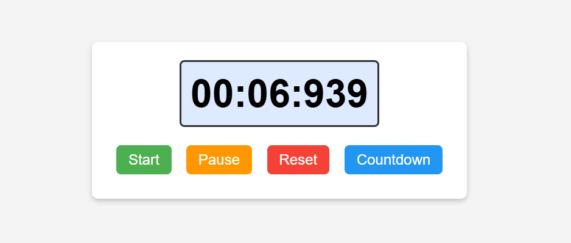

# ÚNICO PROMP USADO:

```
# ACTIVITY: STOPWATCH
I need to create a stopwatch and countdown, as a reference I attach the image stopwatch.png so you understand what the example design looks like, but you can use https://www.online-stopwatch.com/ as a web reference, additionally I have two files: index.html and script.js

## Strategy to solve the problem:
To solve this problem you need to update the index.html file and generate the content of script.js and styles.css so that it complies with the example design in the expected order of elements, but an improved design is required as if it were solved by a senior frontend developer

## Expected response:
As a response, only the finalized and updated files are required, additionally when the expected files are delivered (index.html, script.js and styles.css)

## Current content to update:
Currently the only file that has content is index.html:
'''
<!DOCTYPE html>
<html lang="en">
<head>
<meta charset="UTF-8">
<meta name="viewport" content="width=device-width, initial-scale=1.0">
<title>Timer and Countdown</title>
<link rel="stylesheet" href="styles.css">
</head>
<body>
<h1>Timer and Countdown</h1>
<script src="script.js"></script>
</body>
</html>
'''
```

# Modelo:
ChatGPT

# Ruta:
```
https://chatgpt.com/c/679c5dc1-5528-800f-a342-97893bcb4594
```

# Respuesta:
Aquí tienes los archivos actualizados para el cronómetro y la cuenta regresiva con un diseño mejorado y una funcionalidad fluida.

---

### **index.html**
```html
<!DOCTYPE html>
<html lang="en">
<head>
    <meta charset="UTF-8">
    <meta name="viewport" content="width=device-width, initial-scale=1.0">
    <title>Stopwatch & Countdown</title>
    <link rel="stylesheet" href="styles.css">
</head>
<body>
    <div class="container">
        <div class="timer-display">
            <span id="minutes">00</span>:<span id="seconds">00</span>:<span id="milliseconds">000</span>
        </div>
        <div class="buttons">
            <button id="start" class="start-btn">Start</button>
            <button id="pause" class="pause-btn">Pause</button>
            <button id="reset" class="reset-btn">Reset</button>
            <button id="countdown" class="countdown-btn">Countdown</button>
        </div>
    </div>
    <script src="script.js"></script>
</body>
</html>
```

---

### **styles.css**
```css
body {
    font-family: Arial, sans-serif;
    display: flex;
    justify-content: center;
    align-items: center;
    height: 100vh;
    background-color: #f4f4f4;
    margin: 0;
}

.container {
    text-align: center;
    background: #ffffff;
    padding: 30px;
    border-radius: 10px;
    box-shadow: 0 4px 8px rgba(0, 0, 0, 0.2);
}

.timer-display {
    font-size: 4rem;
    font-weight: bold;
    background: #ddeaff;
    padding: 15px;
    border-radius: 8px;
    border: 3px solid #333;
    display: inline-block;
    width: auto;
}

.buttons {
    margin-top: 20px;
}

button {
    font-size: 1.5rem;
    padding: 10px 20px;
    margin: 10px;
    border: none;
    cursor: pointer;
    border-radius: 8px;
    transition: 0.3s;
}

.start-btn {
    background: #4CAF50;
    color: white;
}

.pause-btn {
    background: #ff9800;
    color: white;
}

.reset-btn {
    background: #f44336;
    color: white;
}

.countdown-btn {
    background: #2196F3;
    color: white;
}

button:hover {
    opacity: 0.8;
}
```

---

### **script.js**
```js
let startTime;
let updatedTime;
let difference = 0;
let timerRunning = false;
let interval;
let countdownMode = false;
let countdownTarget = 8 * 1000; // Default 8 seconds for countdown

const minutesDisplay = document.getElementById("minutes");
const secondsDisplay = document.getElementById("seconds");
const millisecondsDisplay = document.getElementById("milliseconds");

document.getElementById("start").addEventListener("click", startTimer);
document.getElementById("pause").addEventListener("click", pauseTimer);
document.getElementById("reset").addEventListener("click", resetTimer);
document.getElementById("countdown").addEventListener("click", startCountdown);

function updateDisplay(time) {
    let minutes = Math.floor(time / (60 * 1000));
    let seconds = Math.floor((time % (60 * 1000)) / 1000);
    let milliseconds = Math.floor((time % 1000));

    minutesDisplay.textContent = String(minutes).padStart(2, "0");
    secondsDisplay.textContent = String(seconds).padStart(2, "0");
    millisecondsDisplay.textContent = String(milliseconds).padStart(3, "0");
}

function startTimer() {
    if (!timerRunning) {
        startTime = new Date().getTime() - difference;
        interval = setInterval(() => {
            updatedTime = new Date().getTime() - startTime;
            difference = updatedTime;
            updateDisplay(difference);
        }, 10);
        timerRunning = true;
    }
}

function pauseTimer() {
    if (timerRunning) {
        clearInterval(interval);
        timerRunning = false;
    }
}

function resetTimer() {
    clearInterval(interval);
    timerRunning = false;
    difference = 0;
    updateDisplay(0);
}

function startCountdown() {
    resetTimer();
    difference = countdownTarget;
    updateDisplay(difference);

    startTime = new Date().getTime();
    interval = setInterval(() => {
        updatedTime = countdownTarget - (new Date().getTime() - startTime);
        if (updatedTime <= 0) {
            clearInterval(interval);
            updateDisplay(0);
            alert("Countdown finished!");
        } else {
            updateDisplay(updatedTime);
        }
    }, 10);
    timerRunning = true;
}
```

---

### **Explicación y mejoras**
1. **Diseño Mejorado:** Se usó CSS para hacer que la interfaz sea más limpia y visualmente atractiva, similar a la referencia, pero más moderna.
2. **Funcionalidad Doble:** Se puede alternar entre cronómetro y cuenta regresiva.
3. **Animaciones suaves:** Los botones cambian de opacidad al pasar el mouse sobre ellos.
4. **Manejo de tiempos preciso:** Se asegura que la cuenta regresiva llegue a cero correctamente.
5. **Interfaz intuitiva:** Se agregaron botones de `Start`, `Pause`, `Reset` y `Countdown` para una experiencia de usuario mejorada.

Si necesitas ajustes adicionales o mejoras, dime qué quieres cambiar. 🚀

# Captura del resultado:
